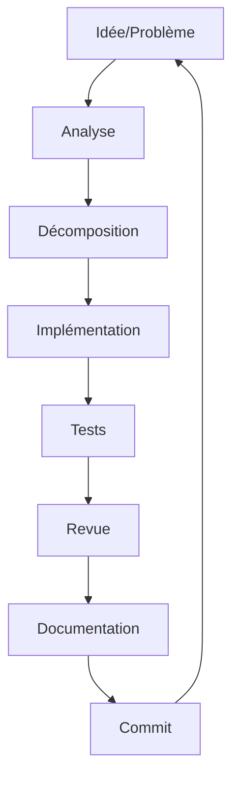
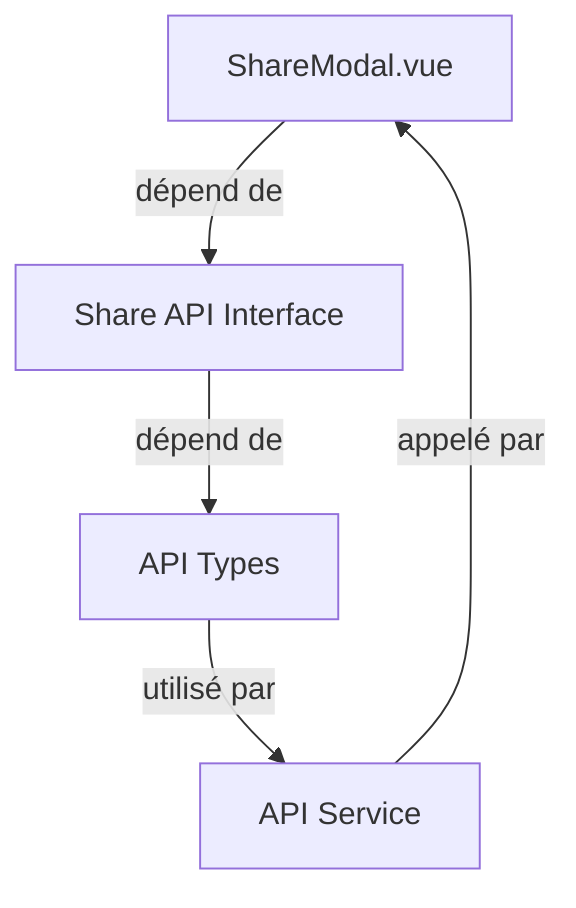

# Silvertransfert - Processus de Travail

> **Objectif** : Structurer le travail pour maximiser l'efficacité et la qualité.
> **Version** : 1.0
> **Dernière mise à jour** : 2026-06-29

## Table des matières
1. [Principes fondamentaux](#principes-fondamentaux)
2. [Cycle de vie d'une tâche](#cycle-de-vie-dune-tâche)
3. [Décomposition des tâches](#décomposition-des-tâches)
4. [Utilisation des sous-agents](#utilisation-des-sous-agents)
5. [Gestion des branches Git](#gestion-des-branches-git)
6. [Revue de code](#revue-de-code)
7. [Tests](#tests)
8. [Documentation](#documentation)
9. [Outils recommandés](#outils-recommandés)

---

## Principes fondamentaux

### 1. Qualité avant vitesse
- Prendre le temps de bien comprendre le problème
- Écrire du code propre et maintenable
- Ne pas sacrifier la sécurité pour la rapidité

### 2. Petite itérations
- Diviser les grandes tâches en petites étapes
- Commiter souvent (mais sans pusher)
- Valider chaque étape avant de passer à la suivante

### 3. Transparence
- Documenter les décisions techniques
- Mettre à jour la mémoire long terme
- Expliquer les choix dans les commits

### 4. Collaboration
- Utiliser des sous-agents pour les tâches complexes
- Demander de l'aide quand nécessaire
- Partager les connaissances

---

## Cycle de vie d'une tâche



### 1. Analyse (10-30 min)

**Objectif** : Comprendre complètement le problème avant de coder.

**Étapes** :
1. Lire attentivement la demande
2. Analyser les fichiers existants concernés
3. Identifier les dépendances
4. Identifier les risques (sécurité, performance, etc.)
5. Vérifier qu'il n'y a pas de solution existante

**Livrable** : Une compréhension claire du problème et des contraintes.

**Checklist** :
- [ ] J'ai compris l'objectif
- [ ] J'ai identifié tous les fichiers concernés
- [ ] J'ai vérifié les dépendances nécessaires
- [ ] J'ai identifié les risques potentiels
- [ ] J'ai une idée de la solution

### 2. Décomposition (5-15 min)

**Objectif** : Diviser la tâche en sous-tâches gérables.

**Règles** :
- Chaque sous-tâche doit tenir dans 1-2 heures max
- Les sous-tâches doivent être indépendantes quand c'est possible
- Prioriser les sous-tâches par ordre logique

**Exemple** :
```
Tâche : "Ajouter un système de drag & drop pour l'upload"
├── Sous-tâche 1 : Créer le composant DropZone
├── Sous-tâche 2 : Implémenter la logique de drag & drop
├── Sous-tâche 3 : Valider les fichiers dragués
├── Sous-tâche 4 : Intégrer avec le composant existant
└── Sous-tâche 5 : Tester l'intégration
```

**Livrable** : Une liste de sous-tâches claires et priorisées.

### 3. Implémentation

**Objectif** : Écrire le code selon les normes du projet.

**Règles** :
- Suivre les normes de codage (`CODING_STANDARDS.md`)
- Respecter les principes de sécurité (`SECURITY_GUIDELINES.md`)
- Commiter après chaque sous-tâche complète
- Ne pas commiter du code qui ne compile pas

**Bonnes pratiques** :
- Commencer par les tests (TDD si possible)
- Écrire le code le plus simple qui fonctionne
- Refactorer ensuite pour la lisibilité
- Valider le typage TypeScript

**Livrable** : Code fonctionnel et propre.

### 4. Tests

**Objectif** : S'assurer que le code fonctionne correctement.

**Règles** :
- Tester chaque fonctionnalité
- Tester les cas nominaux ET les cas d'erreur
- Vérifier les edge cases
- S'assurer que les tests existants passent

**Types de tests** :
1. **Tests unitaires** : Fonctions individuelles
2. **Tests d'intégration** : Interaction entre composants
3. **Tests E2E** : Flux utilisateur complet
4. **Tests de sécurité** : Vérification des vulnérabilités

**Livrable** : Tests passés + code couvert par les tests.

### 5. Revue

**Objectif** : Vérifier la qualité du code avant validation.

**Checklist** (voir aussi `CODING_STANDARDS.md` et `SECURITY_GUIDELINES.md`) :
- [ ] Le code compile sans erreur TypeScript
- [ ] Tous les tests passent
- [ ] Pas de `any` dans le typage
- [ ] Pas de `v-html` ou code dangereux
- [ ] Les inputs sont validés
- [ ] Les erreurs sont gérées
- [ ] Le code suit les conventions de nommage
- [ ] Le code est bien commenté
- [ ] Le code est accessible (a11y)
- [ ] Les performances sont acceptables

**Livrable** : Code validé et prêt à être commité.

### 6. Documentation

**Objectif** : Faciliter la maintenance future.

**À documenter** :
- Les décisions techniques importantes
- Les hacks ou workarounds temporaires
- Les interfaces publiques (props, emits, etc.)
- Les exemples d'utilisation
- Les limitations connues

**Où documenter** :
- Dans le code (commentaires)
- Dans la mémoire long terme (`LONG_TERM_MEMORY.md`)
- Dans des fichiers README si nécessaire

**Livrable** : Code documenté et compréhensible.

### 7. Commit

**Objectif** : Sauvegarder le travail de manière structurée.

**Règles** :
- Commiter souvent (après chaque sous-tâche)
- Messages de commit clairs et descriptifs
- Ne JAMAIS pusher (les commits restent locaux)

**Format des messages** :
```
feat: ajouter le composant DropZone
- Créer DropZone.vue avec drag & drop
- Ajouter la validation des fichiers
- Intégrer avec Home.vue

fix: corriger le bug de validation des fichiers
- Vérifier l'extension avant la taille
- Ajouter test unitaires

refactor: simplifier la logique d'upload
- Extraire la validation dans une fonction
- Utiliser des types plus précis

docs: mettre à jour la documentation
- Ajouter exemples d'utilisation
- Documenter les limitations
```

**Livrable** : Commit(s) clair(s) et atomique(s).

---

## Décomposition des tâches

### Méthode : "Divide and Conquer"

1. **Identifier le cœur du problème**
2. **Séparer en couches** (UI, logique métier, API, etc.)
3. **Diviser chaque couche en sous-tâches**
4. **Prioriser** (dépendances, complexité, risque)

### Exemples

#### Exemple 1 : Nouvelle page de téléchargement

```
Tâche : Créer la page de téléchargement (/t/:id)
├── Backend (si applicable)
│   ├── Créer l'endpoint API /api/download/:id
│   └── Implémenter la logique de vérification
├── Frontend
│   ├── Créer Download.vue (composant principal)
│   │   ├── Ajouter le template avec le formulaire
│   │   ├── Ajouter la logique de récupération du fichier
│   │   └── Ajouter la gestion des erreurs
│   ├── Créer des sous-composants si nécessaire
│   │   ├── FileInfo.vue (affiche les infos du fichier)
│   │   └── PasswordInput.vue (input sécurisé pour le mot de passe)
│   ├── Configurer la route dans router.ts
│   └── Ajouter les styles
└── Tests
    ├── Tests unitaires pour les composants
    └── Test d'intégration pour la page complète
```

#### Exemple 2 : Amélioration de l'upload

```
Tâche : Ajouter la progression de l'upload avec vitesse réseau
├── Analyse
│   └── Vérifier que l'API supporte onUploadProgress
├── Frontend
│   ├── Modifier Home.vue
│   │   ├── Ajouter les refs pour la progression
│   │   ├── Implémenter onUploadProgress
│   │   ├── Calculer la vitesse de transfert
│   │   └── Afficher la progression et la vitesse
│   └── Créer UploadProgress.vue (composant dédié)
│       ├── Props : uploadPct, speed, estimatedTime
│       ├── Template avec barre de progression
│       └── Style avec Tailwind
└── Tests
    └── Tester l'affichage de la progression
```

### Outils de décomposition

- **Mind mapping** pour les tâches complexes
- **Checklists** pour ne rien oublier
- **Diagrammes** (mermaid, draw.io) pour les flux

---

## Utilisation des sous-agents

### Quand utiliser un sous-agent ?

- La tâche peut être divisée en sous-tâches **indépendantes**
- La tâche nécessite des **compétences différentes** (ex : UI vs API)
- La tâche est **trop complexe** pour une seule session
- Vous voulez **paralléliser** le travail

### Comment utiliser un sous-agent ?

1. **Définir la tâche** de manière très claire
2. **Fournir le contexte** nécessaire (fichiers à lire, contraintes)
3. **Définir les livrables** attendus
4. **Lancer le sous-agent** avec `task`
5. **Vérifier et intégrer** les résultats

### Exemple

```typescript
// Tâche principale : "Créer une nouvelle feature de partage"

// Sous-tâche 1 : Backend API
task({
  task: "Créer l'endpoint API /api/share avec authentification",
  agent: "explore",
  context: {
    requirements: "L'endpoint doit accepter un fileId et un email, envoyer un lien de partage",
    security: "Vérifier que l'utilisateur a le droit de partager le fichier",
    files: ["src/router.ts", "src/views/Home/Home.vue"]
  }
});

// Sous-tâche 2 : Composant UI
task({
  task: "Créer le composant ShareModal.vue avec formulaire d'email",
  agent: "explore",
  context: {
    requirements: "Modal avec champ email, bouton envoyer, validation",
    design: "Utiliser Tailwind CSS, style cohérent avec l'app",
    files: ["src/views/Home/components/ui/DropZone.vue"]
  }
});

// Sous-tâche 3 : Intégration
task({
  task: "Intégrer ShareModal avec Home.vue et l'API",
  agent: "explore",
  context: {
    requirements: "Lier le modal au bouton partager, appeler l'API au submit",
    files: ["src/views/Home/Home.vue", "src/router.ts"]
  }
});
```

### Bonnes pratiques avec les sous-agents

1. **Donner des tâches atomiques** (une seule responsabilité)
2. **Fournir tout le contexte nécessaire**
3. **Définir des interfaces claires** entre les sous-tâches
4. **Vérifier les livrables** avant intégration
5. **Documenter les dépendances** entre sous-tâches

### Gestion des dépendances entre sous-tâches



---

## Gestion des branches Git

### Règles générales

- **Ne JAMAIS travailler sur `main`** (sauf corrections urgentes)
- **Une branche par feature/bug**
- **Noms de branches clairs**
- **Commits atomiques** (un commit = une idée)
- **Ne JAMAIS pusher** (les commits restent locaux)

### Stratégie de branchement

```
main (production)
├── develop (intégration)
│   ├── feat/upload-progress (feature)
│   ├── feat/share-files (feature)
│   ├── fix/validation-bug (bugfix)
│   └── refactor/home-component (refactor)
└── hotfix/security-issue (urgence)
```

### Nommage des branches

| Type | Préfixe | Exemple |
|------|---------|---------|
| Feature | `feat/` | `feat/drag-drop-upload` |
| Bugfix | `fix/` | `fix/validation-error` |
| Refactor | `refactor/` | `refactor/upload-logic` |
| Documentation | `docs/` | `docs/update-readme` |
| Performance | `perf/` | `perf/optimize-upload` |
| Security | `security/` | `security/xss-protection` |
| Chore | `chore/` | `chore/update-deps` |

### Workflow complet

```bash
# 1. Créer une nouvelle branche (depuis develop ou main)
git checkout develop
git pull origin develop  # Si on avait le droit de pull
git checkout -b feat/ma-nouvelle-feature

# 2. Travailler sur la feature (commits locaux)
git add .
git commit -m "feat: ajouter le composant X"
git commit -m "fix: corriger le bug Y"

# 3. Si nécessaire, rebaser sur develop (sans pusher)
git fetch origin  # Si on avait accès
git rebase origin/develop

# 4. Vérifier que tout compile et que les tests passent
npm run build
npm run test

# 5. La branche reste locale - PAS DE PUSH
# git push origin feat/ma-nouvelle-feature  # ❌ INTERDIT
```

### Revue de code (si collaboration)

Si plusieurs développeurs travaillent sur le projet :

1. Créer une Pull Request (PR) depuis la branche feature vers develop
2. Assigner des reviewers
3. Attendre les approbations
4. Corriger les commentaires
5. Merge après validation

**Mais dans notre cas** : Pas de push, donc pas de PR. La revue se fait localement.

---

## Revue de code

### Checklist de revue

#### Code général
- [ ] Le code est lisible et bien organisé
- [ ] Les noms sont clairs et cohérents
- [ ] Pas de code dupliqué
- [ ] Pas de code mort (non utilisé)
- [ ] Les commentaires sont utiles

#### TypeScript
- [ ] Tout est bien typé (pas de `any`)
- [ ] Les interfaces/types sont bien définis
- [ ] Les types sont précis (pas de `string` quand un type littéral est possible)
- [ ] Pas de castings inutiles

#### Vue
- [ ] Composition API utilisé (`<script setup>`)
- [ ] Props typées avec `defineProps<Type>()`
- [ ] Emits typées avec `defineEmits<Type>()`
- [ ] Pas de `v-html`
- [ ] Les `v-for` ont des `:key` uniques
- [ ] Les computed sont utilisés pour les valeurs dérivées

#### Sécurité
- [ ] Tous les inputs sont validés
- [ ] Pas de données sensibles exposées
- [ ] Les erreurs sont gérées
- [ ] Pas de `eval` ou code dynamique dangereux

#### Performance
- [ ] Pas de calculs lourds dans les templates
- [ ] Les computed sont utilisés à bon escient
- [ ] Les images utilisent `loading="lazy"`
- [ ] Les composants lourds sont lazy-loaded

### Outils de revue

- **VSCode** : Extensions ESLint, Prettier, TypeScript
- **Git** : `git diff`, `git show`
- **Browser DevTools** : Vérifier le rendu et les performances

---

## Tests

### Stratégie de test

```
Tests Pyramid :
    ┌─────────────┐
    │   E2E Tests  │  5-10%
    ├─────────────┤
    │ Integration  │  15-20%
    ├─────────────┤
    │  Unit Tests  │  70-80%
    └─────────────┘
```

### Framework de test

**Recommandation** : Vitest (intégré avec Vite) + @vue/test-utils

```bash
# Installer les dépendances
npm install -D vitest @vue/test-utils jsdom
```

### Structure des tests

```
tests/
├── unit/
│   ├── components/
│   │   ├── DropZone.spec.ts
│   │   └── FileList.spec.ts
│   ├── composables/
│   │   └── useUpload.spec.ts
│   └── utils/
│       └── file.spec.ts
├── integration/
│   ├── Home.spec.ts
│   └── Download.spec.ts
└── e2e/
    ├── upload-flow.spec.ts
    └── download-flow.spec.ts
```

### Exemple de test unitaire

```typescript
// tests/unit/components/DropZone.spec.ts
import { describe, it, expect } from 'vitest';
import { mount } from '@vue/test-utils';
import DropZone from '@/views/Home/components/ui/DropZone.vue';

describe('DropZone', () => {
  it('renders correctly', () => {
    const wrapper = mount(DropZone, {
      props: {
        isDragging: false,
        files: [],
        isUploading: false
      }
    });
    
    expect(wrapper.find('.drop-zone').exists()).toBe(true);
  });
  
  it('emits dragover event', async () => {
    const wrapper = mount(DropZone, {
      props: {
        isDragging: false,
        files: [],
        isUploading: false
      }
    });
    
    const dropZone = wrapper.find('.drop-zone');
    await dropZone.trigger('dragover');
    
    expect(wrapper.emitted('dragover')).toBeTruthy();
  });
  
  it('shows files when provided', () => {
    const files = [
      { id: '1', name: 'file1.pdf', size: 1024, type: 'application/pdf' }
    ];
    
    const wrapper = mount(DropZone, {
      props: {
        isDragging: false,
        files,
        isUploading: false
      }
    });
    
    expect(wrapper.findAll('.file-item').length).toBe(1);
    expect(wrapper.text()).toContain('file1.pdf');
  });
});
```

### Exemple de test d'intégration

```typescript
// tests/integration/Home.spec.ts
import { describe, it, expect, beforeEach } from 'vitest';
import { mount } from '@vue/test-utils';
import Home from '@/views/Home/Home.vue';
import { createRouter, createWebHistory } from 'vue-router';

describe('Home Page', () => {
  let router: ReturnType<typeof createRouter>;
  
  beforeEach(() => {
    router = createRouter({
      history: createWebHistory(),
      routes: [{ path: '/', component: Home }]
    });
  });
  
  it('displays the upload form', () => {
    const wrapper = mount(Home, {
      global: {
        plugins: [router]
      }
    });
    
    expect(wrapper.find('h1').text()).toContain('SilverTransfert');
    expect(wrapper.find('.drop-zone').exists()).toBe(true);
  });
  
  it('shows error when file is too large', async () => {
    const largeFile = new File([''], 'large.pdf', { type: 'application/pdf' });
    Object.defineProperty(largeFile, 'size', { value: 11 * 1024 * 1024 * 1024 }); // 11Go
    
    const wrapper = mount(Home, {
      global: {
        plugins: [router]
      }
    });
    
    // Simuler le drop d'un fichier trop grand
    const dropZone = wrapper.find('.drop-zone');
    await dropZone.trigger('drop', {
      dataTransfer: {
        files: [largeFile]
      }
    });
    
    // Devrait afficher une erreur
    expect(wrapper.find('.error-message').exists()).toBe(true);
  });
});
```

### Bonnes pratiques de test

1. **Tests isolés** : Chaque test ne dépend pas des autres
2. **Noms clairs** : `it('should do X when Y')`
3. **Une assertion par test** (en général)
4. **Tester les edge cases** : valeurs nulles, limites, erreurs
5. **Mock les dépendances externes** (API, localStorage, etc.)

---

## Documentation

### Quand documenter ?

| Situation | Où documenter ? | Format |
|-----------|-----------------|--------|
| Décision technique majeure | `LONG_TERM_MEMORY.md` | Markdown |
| Interface publique (composant) | Dans le fichier `.vue` | Commentaires JSDoc |
| Fonction complexe | Au-dessus de la fonction | Commentaires |
| Hack/workaround | Dans le code + `LONG_TERM_MEMORY.md` | Commentaires + Markdown |
| Flux utilisateur | `LONG_TERM_MEMORY.md` | Diagramme Mermaid |

### Exemples de documentation

#### Documentation JSDoc

```typescript
/**
 * Valide un fichier avant upload.
 * 
 * @param file - Le fichier à valider
 * @returns Un objet avec la validité et éventuellement une erreur
 * 
 * @example
 * ```typescript
 * const result = validateFileBeforeUpload(myFile);
 * if (!result.valid) {
 *   showError(result.error);
 * }
 * ```
 */
function validateFileBeforeUpload(file: File): { valid: boolean; error?: string } {
  // ...
}
```

#### Documentation de composant

```vue
<script setup lang="ts">
/**
 * Composant DropZone pour l'upload de fichiers par drag & drop.
 * 
 * Props :
 *   - isDragging: boolean - Indique si un fichier est en train d'être dragué
 *   - files: FileItem[] - Liste des fichiers sélectionnés
 *   - isUploading: boolean - Indique si un upload est en cours
 * 
 * Emits :
 *   - @dragover - Émis quand un fichier est dragué au-dessus de la zone
 *   - @dragleave - Émis quand le drag quitte la zone
 *   - @drop - Émis quand un fichier est droppé
 *   - @open-picker - Émis pour ouvrir le sélecteur de fichiers
 * 
 * Slots :
 *   - default - Contenu principal
 *   - uploading - Contenu affiché pendant l'upload
 */
// ...
</script>
```

#### Documentation dans la mémoire long terme

```markdown
### 2026-06-29 - Implémentation de la progression d'upload

**Objectif** : Ajouter l'affichage de la progression et de la vitesse d'upload.

**Décision technique** : 
- Utiliser `onUploadProgress` d'Axios pour récupérer la progression
- Calculer la vitesse en octets/seconde
- Estimer le temps restant en fonction de la vitesse et de la taille restante

**Implémentation** :
- Ajout d'un ref `uploadProgress` et `uploadSpeed` dans Home.vue
- Mise à jour de la fonction `transfer()` pour utiliser onUploadProgress
- Création du composant UploadProgress.vue pour l'affichage

**Formule du temps restant** :
```
remainingTime = (totalSize * (100 - progress) / 100) / speed
```

**Problèmes rencontrés** :
- Problème : `onUploadProgress` peut être appelé plusieurs fois rapidement
- Solution : Utiliser un debounce pour éviter les re-rendus trop fréquents

**Fichiers modifiés** :
- `src/views/Home/Home.vue` - Ajout de la logique de progression
- `src/views/Home/components/ui/UploadProgress.vue` - Nouveau composant

**Tests** :
- Test unitaire pour UploadProgress.vue
- Test d'intégration pour la progression dans Home.vue

**Commit** : a1b2c3d
```

---

## Outils recommandés

### Éditeurs
- **VSCode** (recommandé)
  - Extensions : Volar, ESLint, Prettier, Tailwind CSS IntelliSense
  - Configuration : Voir `.vscode/` si existe

### Outils de développement
- **Git** : `git`, `gitk`, `GitKraken`
- **Node.js** : `npm`, `pnpm`, `bun`
- **Browser DevTools** : Chrome, Firefox
- **API Testing** : Postman, Insomnia

### Outils de qualité
- **Linting** : ESLint (déjà configuré)
- **Formattage** : Prettier (à configurer)
- **Type Checking** : TypeScript compiler, Vue TSC
- **Testing** : Vitest, @vue/test-utils

### Outils de documentation
- **Markdown** : Pour la documentation
- **Mermaid** : Pour les diagrammes
- **Draw.io** : Pour les schémas complexes

### Configuration recommandée

#### ESLint

```json
{
  "extends": [
    "eslint:recommended",
    "plugin:vue/vue3-recommended",
    "plugin:@typescript-eslint/recommended",
    "plugin:prettier/recommended"
  ],
  "parser": "vue-eslint-parser",
  "parserOptions": {
    "parser": "@typescript-eslint/parser",
    "ecmaVersion": "latest",
    "sourceType": "module"
  },
  "rules": {
    "@typescript-eslint/no-explicit-any": "error",
    "@typescript-eslint/no-unused-vars": "error",
    "vue/multi-word-component-names": "off"
  }
}
```

#### Prettier

```json
{
  "semi": true,
  "singleQuote": true,
  "tabWidth": 2,
  "trailingComma": "es5",
  "printWidth": 100,
  "useTabs": false
}
```

---

## Checklist finale avant validation

### Code
- [ ] Le code compile sans erreur TypeScript
- [ ] Tous les tests passent
- [ ] Pas de `any` dans le typage
- [ ] Pas de `v-html` ou code dangereux
- [ ] Les inputs sont validés
- [ ] Les erreurs sont gérées
- [ ] Le code suit les conventions de nommage
- [ ] Le code est bien commenté

### Sécurité
- [ ] Voir `SECURITY_GUIDELINES.md`

### Documentation
- [ ] Le code est documenté
- [ ] Les décisions techniques sont notées dans `LONG_TERM_MEMORY.md`
- [ ] Les fichiers créés/modifiés sont décrits

### Git
- [ ] Les commits sont clairs et atomiques
- [ ] Les changements sont commités (sans push)
- [ ] La branche suit les conventions de nommage

### Revue
- [ ] J'ai relu mon code
- [ ] J'ai vérifié les edge cases
- [ ] J'ai testé manuellement

---

**Rappel** : La qualité du code est la responsabilité de chacun. Prenez le temps de bien faire les choses.
